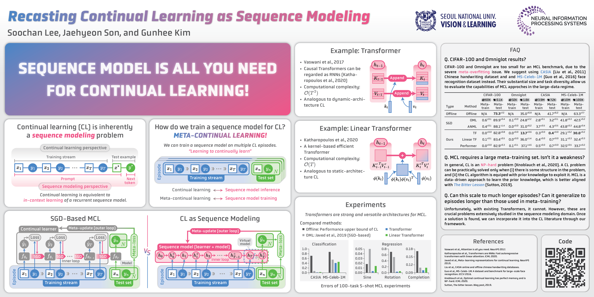

# Recasting Continual Learning as Sequence Modeling

This repository contains the code for our NeurIPS 2023 paper titled [Recasting Continual Learning as Sequence Modeling](https://arxiv.org/abs/2310.11952).
For a brief overview of the paper, please check [this tweet](https://x.com/SoochanL33/status/1733880387443519792).



## Requirements

- Python 3.10
- Pip packages:
```bash
pip install -r requirements.txt
```

## Usage

The basic usage of the training script is as follows:
```bash
python train.py -mc [model config] -dc [data config] -o [override options] -l [log directory]
```

In `commands.sh`, we provide the commands used to train the models in the paper.

## Downloading Datasets

All datasets except MS-Celeb-1M are downloaded automatically by the code.

### MS-Celeb-1M

Use BitTorrent to download the dataset from [Academic Torrents](https://academictorrents.com/details/9e67eb7cc23c9417f39778a8e06cca5e26196a97).
```bash
transmission-cli https://academictorrents.com/download/9e67eb7cc23c9417f39778a8e06cca5e26196a97.torrent -w data
```

## Citation

```bibtex
@inproceedings{Lee2023Recasting,
  author    = {Soochan Lee and Jaehyeon Son and Gunhee Kim},
  title     = {Recasting Continual Learning as Sequence Modeling},
  booktitle = {NeurIPS},
  year      = {2023},
}
```
